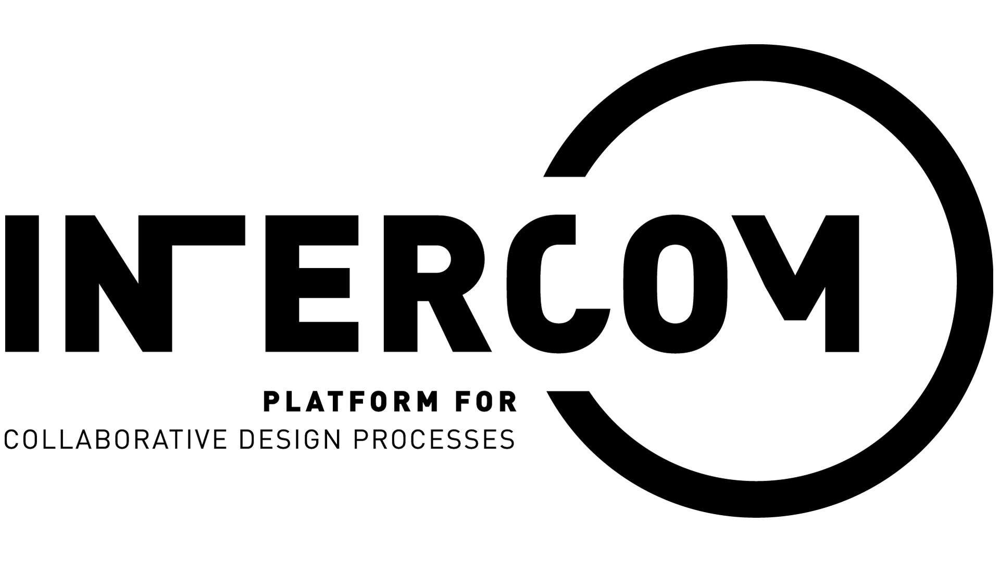

<!--
*** Thanks for checking out the Best-README-Template. If you have a suggestion
*** that would make this better, please fork the repo and create a pull request
*** or simply open an issue with the tag "enhancement".
*** Thanks again! Now go create something AMAZING! :D
***
***
***
*** To avoid retyping too much info. Do a search and replace for the following:
*** thk-code-arch, intercom, twitter_handle, email, INTERCOM, web-based prototype of interCOM - platform for collaborative design
-->

<!-- PROJECT SHIELDS -->
<!--
*** I'm using markdown "reference style" links for readability.
*** Reference links are enclosed in brackets [ ] instead of parentheses ( ).
*** See the bottom of this document for the declaration of the reference variables
*** for contributors-url, forks-url, etc. This is an optional, concise syntax you may use.
*** https://www.markdownguide.org/basic-syntax/#reference-style-links
[![Contributors][contributors-shield]][contributors-url]
[![Forks][forks-shield]][forks-url]
[![Stargazers][stars-shield]][stars-url]
[![Issues][issues-shield]][issues-url]
[![MIT License][license-shield]][license-url]
[![LinkedIn][linkedin-shield]][linkedin-url]
-->

<!-- PROJECT LOGO -->
<br />
<p align="center">
  <a href="https://github.com/thk-code-arch/intercom">
    
  </a>

  <h3 align="center">INTERCOM</h3>

  <p align="center">
    web-based prototype of interCOM - platform for collaborative design
    <br />
    <a href="https://github.com/thk-code-arch/intercom"><strong>Explore the docs »</strong></a>
    <br />
    <br />
    <a href="https://github.com/thk-code-arch/intercom">View Demo</a>
    ·
    <a href="https://github.com/thk-code-arch/intercom/issues">Report Bug</a>
    ·
    <a href="https://github.com/thk-code-arch/intercom/issues">Request Feature</a>
  </p>
</p>

<!-- TABLE OF CONTENTS -->
<details open="open">
  <summary><h2 style="display: inline-block">Table of Contents</h2></summary>
  <ol>
    <li>
      <a href="#about-the-project">About The Project</a>
      <ul>
        <li><a href="#built-with">Built With</a></li>
      </ul>
    </li>
    <li>
      <a href="#getting-started">Getting Started</a>
      <ul>
        <li><a href="#prerequisites">Prerequisites</a></li>
        <li><a href="#installation">Installation</a></li>
      </ul>
    </li>
    <li><a href="#usage">Usage</a></li>
    <li><a href="#roadmap">Roadmap</a></li>
    <li><a href="#contributing">Contributing</a></li>
    <li><a href="#license">License</a></li>
    <li><a href="#contact">Contact</a></li>
    <li><a href="#acknowledgements">Acknowledgements</a></li>
  </ol>
</details>

<!-- ABOUT THE PROJECT -->

## About The Project

### Built With

- []()
- []()
- []()

<!-- GETTING STARTED -->

## Getting Started

To get a local copy up and running follow these simple steps.

### Prerequisites

Docker environment is needed. Example docker-compose depends on nginx-proxy &
Let's encrypt.

### Installation

1. Clone Repo
   ```sh
   git clone https://github.com/thk-code-arch/intercom.git
   ```
2. Prepare secrets.env
   ```sh
   vi secrets.env
   ```
3. Start server
   ```sh
   docker-compose up -d
   ```

<!-- USAGE EXAMPLES -->

## Usage

<!-- ROADMAP -->

## Roadmap

See the [TODO](https://github.com/thk-code-arch/intercom/blob/master/TODO.md) for a list of proposed features (and known issues).

<!-- CONTRIBUTING -->

## Contributing

Contributions are what make the open source community such an amazing place to be learn, inspire, and create. Any contributions you make are **greatly appreciated**.

Start with one of the following repositorys:

Client: [https://github.com/thk-code-arch/intercom-frontend](https://github.com/thk-code-arch/intercom-frontend)
Server: [https://github.com/thk-code-arch/intercom-backend](https://github.com/thk-code-arch/intercom-backend)

Or start with full local development setup.
See the [README](https://github.com/thk-code-arch/intercom/blob/master/development/README.md) for a list of proposed features (and known issues).

1. Fork the Project
2. Create your Feature Branch (`git checkout -b feature/AmazingFeature`)
3. Commit your Changes (`git commit -m 'Add some AmazingFeature'`)
4. Push to the Branch (`git push origin feature/AmazingFeature`)
5. Open a Pull Request

<!-- LICENSE -->

## License

?

<!-- CONTACT -->

## Contact

Website: [https://bim-cloud.org](https://bim-cloud.org)
Project Link: [https://github.com/thk-code-arch/intercom](https://github.com/thk-code-arch/intercom)

<!-- ACKNOWLEDGEMENTS -->

## Acknowledgements

- []()
- []()
- []()
